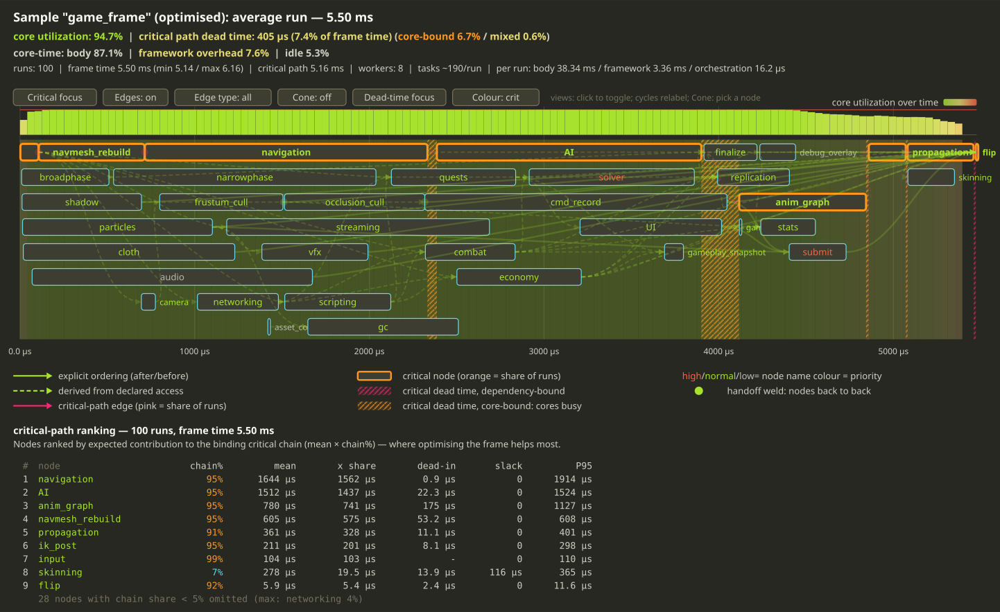

# Macrame
###### *Threads, knotted on purpose.*

Macrame is a C++23 high-level parallelisation framework built around controlled access to shared resources.

It's a comprehensive task system with a work-stealing scheduler, dependency graphs, coroutines, cancellation, and data-parallel loops. Tasks declare the resources they touch; the framework derives safe parallelism from the declarations, and a runtime harness catches any violations.

Inspired by game engines that need high performance, low latency, soft real-time frame budgets, and many interacting subsystems sharing state. Built to fit any system with similar requirements. No external dependencies.

#### How it differs from existing task systems

- Access control (`Guarded<T>`) provides a thread-safe API for shared objects.
- Common state-sharing idioms as built-in primitives: static task graphs, command lists (`Deferred<T>`), double buffering (`Versioned<T>`), and others.
- The runtime harness is designed to catch issues early. Data access violations fail fast, deadlocks are detected at runtime.

For a feature-by-feature comparison with Unreal Engine Tasks System, Taskflow, TBB, HPX, Folly, Go, and others, see [docs/task-systems-comparison.md](docs/task-systems-comparison.md).

[](https://github.com/macrame-ts/macrame/actions/workflows/ci.yml)
[](LICENSE)


**[Quick start](docs/quickstart.md)**

---

## Applications

This framework targets soft real-time systems that handle complex concurrency. It is well suited for applications with:

- Multiple separate internal parts, such as subsystems or "data islands", that are thread-unsafe on their own (think physics simulation, animation, audio, AI; or a server's services, a simulation's modules).
- Intensive communication and data sharing between those parts.
- A need to make each part thread-safe so the rest of the system can drive it concurrently and correctly.

Building this by hand with mutexes or a standard task library is hard even for specialists. The goal of Macrame is to make this process safe and straightforward. It removes a large class of data-race and ordering bugs, along with the effort required to police them.

The framework is built on the concept of high-level parallelism. It encourages expressing concurrency where the surface area is smallest, such as between coarse parts rather than deep inside every algorithm. Parallelise top-down until all CPU cores are efficiently utilised and low-level parallelisation stops paying off. Reducing low-level multithreading leads to less complexity and fewer bugs.

This library is likely not the best choice if your problem involves a single tight data-parallel kernel, one shared container, or fully independent jobs with no shared state. `std::for_each(par)` will serve you better.

---

## Why controlled access

Most task systems schedule work and leave shared-data safety up to the user, or they offer only task dependencies to manage it. Both of these common approaches have limitations:

- Locking shared state with mutexes is the simplest and most popular approach, but it is error-prone and inefficient. A forgotten or mis-scoped lock can cause silent data races, while correct locks can serialise access and convoy under contention. Correctness lives in scattered conventions that no tool verifies. Many issues are timing-dependent and appear only in production.
- Relying on task dependencies is problematic for data sharing. Dependencies exist to express ordering. Using them to protect shared data requires manually encoding which accesses conflict for every pair of tasks. This creates complex bookkeeping that results in rigid graphs and breaks as soon as access patterns change. Ordering and data access governance are different concerns, and conflating them makes systems brittle.

Macrame separates these concerns. You declare the data your logic accesses and whether that access is read-only or read/write. The framework then derives the ordering and exclusion needed for safety. The runtime harness verifies that nothing touches shared state without declaring it first, aborting with a stack trace instead of allowing a race condition. Dependencies remain available for genuine ordering, but they are no longer overloaded to represent data sharing.

```cpp
ts::Guarded<Inventory> inventory{ "inventory" };
// The parameter's const-ness is the access mode declaration.
inventory.access([](Inventory& inv) { inv.add(sword); }).sync(); // `T&`: exclusive read/write access
auto n = inventory.access([](const Inventory& inv) { return inv.count(); }).sync(); // `const T&`: read-only, concurrent with other readers
```

---

## Examples

Here is a brief look at how the framework operates in practice.

### 1. A thread-safe API for one object

You can wrap a thread-unsafe object in `Guarded<T>`. You pass it a functor, and the parameter's const-ness declares your access type. A mutable reference requests exclusive write access, while a const reference requests "shared" read access.

```cpp
ts::Guarded<Inventory> inventory{ "inventory" };

// `access` - runs on the calling thread if the object is free right now, otherwise waits
// its turn. Zero-allocation. Best for short functors.
inventory.access([](Inventory& inv) { inv.add(sword); }).sync(); // write
auto n = inventory.access([](const Inventory& inv) { return inv.count(); }).sync(); // read

// `async` - always scheduled off the calling thread, returns a Task you can await, sync,
// or drop (fire-and-forget). Best for functors you don't want running inline.
inventory.async([](Inventory& inv) { inv.defragment(); });
```

The `access` method expects the caller to wait for the result. The whole operation lives in the returned caller-owned handle and allocates nothing. It is *opportunistic*: it skips scheduling entirely and runs the functor inline if the object is uncontended. The `async` method is detached, it never blocks the caller.

With coroutines, the same access reads as ordinary linear code. Awaiting the task suspends the coroutine until access is granted, then returns an RAII guard with direct access, checked by the harness.

```cpp
ts::Task<void> loot(ItemId id)
{
    auto inventory = co_await ts::read_write(guarded_inventory); // suspend until exclusive access; no thread blocked
    inventory->add(id); // direct access, harness-checked
    inventory->recompute_weight();
} // access released at scope exit
```

This eliminates the need to use locks. Concurrent writes are serialised, reads run together, and any code that touches the inventory without a grant will fail.

### 2. A game frame as a graph

Each subsystem is represented by its own `Guarded<T>`. You declare what each node reads and writes, and `compile()` derives the schedule from the access conflicts. Explicit ordering is only needed for business logic, not to prevent data races:

```cpp
ts::Guarded<Physics> physics{ "physics" };
ts::Guarded<Animation> anim{ "anim" };
ts::Guarded<Audio> audio{ "audio" };
ts::Guarded<Renderer> renderer{ "renderer" };

ts::Static_task_graph frame;

// A node declares read or write access to each guarded object.
frame.add_node("step", [](Physics& p) { p.step(); }, physics);
frame.add_node("pose", [](const Physics& p, Animation& a) { a.pose(p); }, physics, anim);
auto sfx = frame.add_node("mix", [](const Physics& p, Audio& s) { s.mix(p); }, physics, audio);

// Reads physics and anim, writes renderer:
auto render = frame.add_node("render",
    [](const Physics& p, const Animation& a, Renderer& r) { r.submit(p, a); },
    physics, anim, renderer);

render.after(sfx); // explicit ordering, for intent that access alone doesn't capture

// edges are derived from access declaration and explicit ordering
frame.compile();

// Compile once, execute many times. A run reuses the compiled nodes and allocates only its
// completion handle - no per-node allocation.
for (int f = 0; f < frame_count; ++f)
    frame.execute().sync();
```

The two physics readers (`pose`, `mix`) run in parallel. `render` waits for both its inputs and for `sfx`. If a node's access changes, the schedule updates automatically without requiring manual edge maintenance.

### 3. Many producers, one atomic apply

`Deferred<T>` implements the command list pattern. Instead of mutating shared state directly, each producer *records* its intended changes into a buffer. A single later step applies them all at once. Recording requires no access to the target, allowing producers to run in parallel without blocking each other or any readers.

```cpp
ts::Guarded<World> world{ "world" };
ts::Deferred<World> staged{ world };

// Producers record changes into the buffer. Each producer uses its own recorder.
ts::Recorder<World> rec = staged.recorder();
rec.stage([e](World& w) { w.apply_damage(e); }); // recorded, not applied yet

// Other work reads `world` concurrently since recording holds no grant.
auto hp = world.async([](const World& w) { return w.health_of(player); });

// The whole batch of changes is applied as one write in a deterministic order.
staged.commit().sync();
```

### 4. Stable reads while the next version is built

`Versioned<T>` implements the double buffer pattern. It keeps two copies of the state: a published version for readers, and a next version being prepared. Readers get a stable view for the whole frame, while producers build the next version without interrupting them.

```cpp
ts::Versioned<Poses> poses{ "poses" };

// Producers build the next version without blocking readers.
ts::Recorder<Poses> rec = poses.recorder();
rec.stage([id, xf](Poses& p) { p.set(id, xf); });

// Readers see the last published version, stable and uncontended.
auto n = poses.read([](const Poses& p) { return p.count(); }).sync();

// The next version is published.
poses.publish().sync();
```

### 5. Seeing the frame — the built-in trace

The graph profiles itself. Using the `--trace` flag runs a mock game frame and renders the average run. The measured critical path is pinned to the top lane, parallel work is packed into rows below, and dead-time bands show where the critical chain waited.
<!-- NOTE: the interactive link below is the GitHub Pages URL (Pages serving /docs from
     master) - dead until Pages is enabled at the flip (docs/going-public.md). -->
The SVG output is interactive and includes hover tooltips with per-node stats and access declarations, and view-toggle buttons. Because GitHub strips scripts from images, the picture below is static. You can open the interactive version in a browser or view the file locally. It displays an aggregation of all frames, providing a high-level picture of the entire session.



---

## What's in the box

The framework is layered and composable. You can use as much or as little as you need. Features include:

- Scheduler. An efficient work-stealing scheduler with configurable idle policies and task priorities. Minimal API, can be used independently.
- Tasks. You can launch work and compose it using coroutines: `co_await` is the standard continuation mechanism, allowing pipelines to read as straight-line code. It includes cooperative cancellation and priority support. Suspended tasks free their worker, preventing deadlocks in deep fork-join scenarios.
- Data-parallel loops. Functions like `parallel_for` handle data-parallel work safely. Additional utilities like `parallel_for_async` and `parallel_for_colored` provide extra flexibility.
- Coroutines. You can await any task or request read and write access to objects. Holding an access guard across a suspension point is automatically detected and results in a fast failure.
- Guarded objects. `Guarded<T>` provides a thread-safe API for a shared object. It manages a reader and writer queue with concurrent reads and exclusive writes.
- Static task graphs. These are directed acyclic graphs built once and run multiple times. Edges are derived from access conflicts, and executions reuse compiled nodes to avoid memory allocations. Visualisation and profiling tools are included to track parallelism metrics.
- Design patterns. Utilities like `Deferred<T>`, `Versioned<T>` and others provide high-level building blocks.

The current unreleased version (v0.1.0) has a stable API shape, though it is not completely frozen. The changelog outlines the contents of this version. Certain areas are actively evolving, including performance optimizations, a platform abstraction layer, task-local storage and more. See [docs/roadmap.md](docs/roadmap.md) for more details on future plans.

---

## Verification

The concurrency behaviour is checked several ways:

- A comprehensive test suite that includes subprocess death tests for every fatal path.
- Clean results from ThreadSanitizer and AddressSanitizer.
- Deterministic end-to-end samples that compare independent runs for consistency.
- A runtime harness to detect data-access violations and deadlocks.

---

## Requirements & building

C++23, no external dependencies. Failures are fatal-by-design — see the docs. Compilers: MSVC and clang-cl on Windows; clang on Linux.

- **Visual Studio 2022+**: open `macrame.slnx` (x64).
- **CMake**: presets for `windows-msvc`, `windows-clang-cl`, `windows-shipping`, `linux-clang`, and `linux-tsan` (the ThreadSanitizer stress driver).

Running the built driver with no arguments runs everything; `--tests`, `--bench`, and `--stress` isolate parts (`--help` lists the rest).

---

## Documentation

- **[docs/quickstart.md](docs/quickstart.md)** — zero to a running program.
- **[docs/guide.md](docs/guide.md)** — the user guide: concepts, layers, patterns, and use cases.
- **[docs/design.md](docs/design.md)** — design rationale and rejected alternatives.
- **[docs/task-systems-comparison.md](docs/task-systems-comparison.md)** — compares Macrame to other task systems.
- **[docs/roadmap.md](docs/roadmap.md)** — where the library is going.

---

## Contributing

Contributions of all sizes are welcome — bug reports, docs, tests, code. See [CONTRIBUTING.md](CONTRIBUTING.md).

---

## License

MIT.
